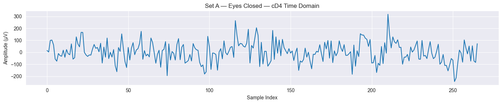

# EEG Seizure Detection: Signal Processing and Machine Learning Pipeline

This repository contains a research-oriented implementation of an EEG seizure detection pipeline using the Bonn EEG dataset. The project integrates classical signal-processing methods with machine-learning models to evaluate how well engineered time–frequency features can discriminate seizure from non-seizure neural activity.

---

## Abstract

Seizure detection from EEG is a fundamental problem in clinical neurophysiology and neural engineering. This project builds a full pipeline for seizure classification using publicly available single-channel EEG segments. I extracted analytic-envelope and energy-based features via Discrete Wavelet Transform (DWT) and Hilbert transforms, constructed a 21-feature dataset, and evaluated both supervised (Random Forest, Logistic Regression) and unsupervised (K-means) methods. Results show that energy in specific sub-bands provides reliable discriminative power and that model performance is consistent across clustering- and classification-based approaches.

---

## Methods

### **Dataset**
- Bonn EEG dataset 
- Raw EEG segments labeled as seizure vs. non-seizure
- All data are pre-segmented and de-identified

### **Signal Processing**
- Discrete Wavelet Transform (db4)
- Decomposition into standard sub-bands
- Hilbert transform applied to each band to extract analytic envelope
- Feature engineering:
  - Band energy
  - Variance, skewness, kurtosis
  - Entropy-based features
  - 21 total features

### **Machine Learning**
- **Supervised models**
  - Logistic Regression  
  - Random Forest (feature importance analysis)
- **Unsupervised models**
  - K-means clustering
  - PCA-based visualization
  - ARI and silhouette metrics

### **Evaluation**
- Train/validation split  
- Feature-importance ranking  
- Visualization of decision boundaries and cluster structure  

---

## Key Findings
- Wavelet energy in specific bands is highly predictive of seizure activity.
- Random Forest achieves strong performance with interpretable feature rankings.
- Unsupervised clustering recovers meaningful structure consistent with supervised models.
- Feature engineering plays a larger role than model choice in this dataset.

---

## Repository Structure

- P1_project_EDA.ipynb # Data inspection and preprocessing
- P2_supervised_learning.ipynb # Logistic Regression and Random Forest models
- P3_unsupervised_learning.ipynb # K-means clustering, PCA, evaluation
- P4_project_wrap_up.ipynb # Summary notebook with integrated results

---

## Main Notebook
For a full summary of the pipeline and results, see:  
**P4_project_wrap_up.ipynb**

---

## Authorization and Data Use

This project uses the publicly available **Bonn EEG dataset**, which is fully de-identified and released for research and educational purposes. No protected health information (PHI) is included.

All analyses in this repository are performed solely on publicly released data and comply with the dataset’s permitted use guidelines. No proprietary or restricted clinical data were used.

The code in this repository is authored by Chenyi Dai and is released for academic, non-commercial use. Users may reference or adapt the code with appropriate attribution.

This project is intended for educational and research demonstration purposes only and does not constitute clinical diagnostic software.

